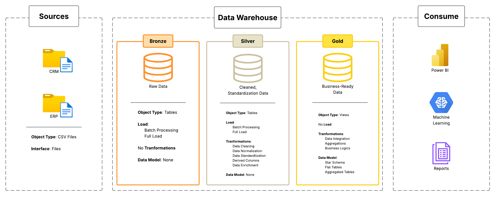

# DWH Project

## Project Description

**DWH Project** is a comprehensive **Data Warehouse** solution designed to centralize, integrate, and manage data from multiple sources. This project provides a robust infrastructure for collecting, transforming, and storing data in a structured data warehouse environment.

### What is This?

A modern data warehouse system built with **PL/pgSQL** that enables organizations to:
- **Consolidate** data from diverse data sources
- **Transform** raw data into meaningful business insights
- **Store** structured data in an optimized format for analytics
- **Query** data efficiently for business intelligence and reporting

### What We Do

We provide:
- ✅ **Data Integration** - Seamless integration of multi-source data
- ✅ **Data Transformation** - ETL/ELT pipelines for data processing
- ✅ **Data Modeling** - Structured dimensional and fact tables
- ✅ **Data Quality** - Validation and cleansing processes
- ✅ **Scalable Architecture** - Built for enterprise-level data operations

---

## Project Overview

The DWH Project follows a modular architecture composed of:

### Directory Structure

```
dwh-project/
├── docs/                    # Project documentation and diagrams
├── datasets/               # Sample and raw datasets
├── scripts/                # ETL and database scripts
├── tests/                  # Test cases and validations
├── LICENSE                 # MIT License
└── README.md              # This file
```

### Key Components

- **docs/** - Architecture diagrams, data models, and integration workflows
- **datasets/** - Sample data and staging areas
- **scripts/** - PL/pgSQL scripts for data transformation and loading
- **tests/** - Data validation and quality tests

---

## Data Architecture

### System Architecture

The following diagram illustrates the overall architecture of the DWH Project:



### Data Flow

This diagram shows how data flows through the system:


### Data Integration Pattern

The integration pattern used in this project:


### Data Model

The dimensional model and schema design:


---

## Technology Stack

- **Database**: PostgreSQL with PL/pgSQL
- **Language**: PL/pgSQL for stored procedures and functions
- **License**: MIT

---

## Getting Started

### Prerequisites

- PostgreSQL 12 or higher
- Git for version control

### Setup

1. Clone the repository:
   ```bash
   git clone https://github.com/YummieGG/dwh-project.git
   cd dwh-project
   ```

2. Review the documentation in the `docs/` folder for detailed architecture information.

3. Execute scripts from the `scripts/` folder to set up your data warehouse:
   ```bash
   # Run database initialization scripts
   psql -U postgres -d your_database -f scripts/setup.sql
   ```

---

## Project Structure Details

### Scripts (`scripts/`)
Contains PL/pgSQL scripts for:
- Database initialization
- ETL processes
- Data transformations
- Stored procedures and functions

### Tests (`tests/`)
Includes validation and testing scripts to ensure:
- Data quality
- Referential integrity
- Transformation accuracy

### Datasets (`datasets/`)
Sample and raw data files for:
- Initial setup
- Testing
- Development and staging

### Documentation (`docs/`)
Visual and detailed documentation including:
- Architecture overview
- Data flow diagrams
- Integration patterns
- Data models and schema design

---

## License

This project is licensed under the **MIT License** - see the [LICENSE](LICENSE) file for details.

---

## Contributing

Contributions are welcome! Please feel free to submit pull requests or open issues for bugs and feature requests.

---

## Contact & Support

For questions or support, please reach out to the project maintainers or open an issue in the repository.

---

**Last Updated**: July 2026
